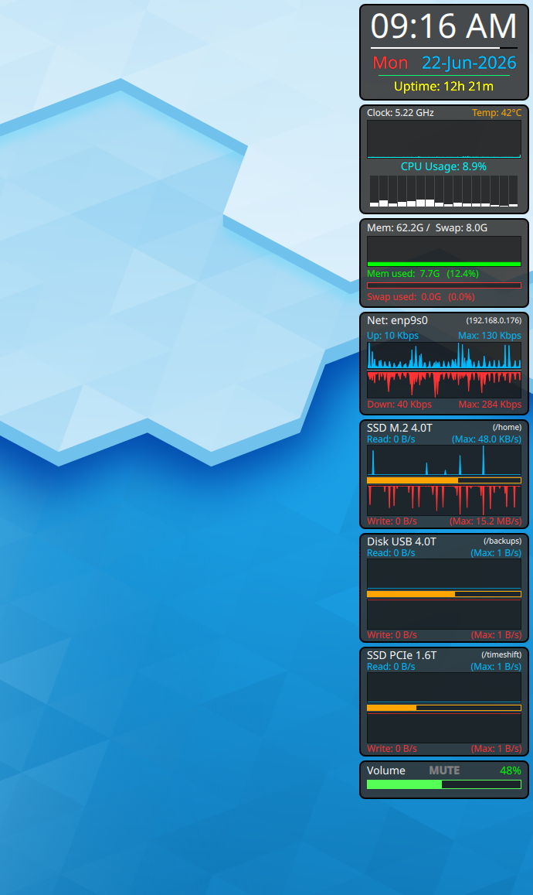

# Tom's Quickshell System Monitor Widgets Panel

A highly optimized, System Monitor Panel of widgets, Clock, Cpu, Memory, Network, Disks, Volume, dashboard built for Linux desktop setups using `quickshell`. This widget cluster reads telemetry data directly from virtual kernel file systems (`/proc` and `/sys`), ensuring extremely low CPU usage and near-zero runtime latency.

 <!-- Add a nice screenshot here -->

## Widgets

- **Clock:** Time, Seconds bar, Date, Uptime.
- **ClockUTC:** Optional UTC clock, Time, Date. (uncomment in shell.qml to activate)
- **CPU:** CPU Clock, CPU temp, CPU average usage, CPU usage per core vertical bars.
- **Mem/Swap:** Memory / Swap, Total, Memory usage graph, Swap usage bar.
- **Network:** Network, Device name, IP address, Upload graph bits/sec with scale max, and Download graph bits/sec with scale max.
- **Disk:** Label for Disk/SSD type/size, mount point, Read bytes/sec graph with scale max, partition used bar, Write bytes/sec graph with scale max.
- **Volume:** Volume setting and display bar, mouse wheel or click, click MUTE button.

## Tooltips

- **Timezone** hover over Time in main clock widget.
- **CPU Model** hover over the CPU graph.
- **Disk Model** hover over the Disk label you set for modelSize in shell.qml.
- **Disk Device** hover over the mountPoint on the Disk widget.
- **Disk Usage Percent** hover over the orange usage bar.

## Clickables

- **24hr Time** double click on the Time and it will toggle between AM/PM to 24hr clock.
- **open Calendar** click on the Date to open a Month calendar at timeanddate.com
- **open File manager** click on the mountPoint and it opens a File manager to that location.
- **Audio Mute** click on MUTE in Volume to toggle Mute.

## Features

- **Very Efficient Processing:** Replaced all shell process loops (`cat`, `awk`, `grep`) with high-speed virtual `FileView` handles.
- **Hardware Agnostic Thermal Tracking:** Fully parameterized 2-layer lookup to support modern AMD (`k10temp`) and Intel (`coretemp`) sensors.
- **Unified Graph Design:** Smooth, right-to-left scrolling visualizations across all core telemetry frameworks.

## Installation & Deployment

1. Make sure you have `quickshell` package installed on your system.  Either from your repo, or from: https://git.outfoxxed.me/quickshell/quickshell.git  My System Monitor widgets were tested with Quickshell 0.2.1 from the Fedora repo.  Should work on the latest 0.3.0 from the GIT repo.
   ```bash
   sudo dnf install quickshell
   ```
2. Clone or move these configuration files into your local directory:
   ```bash
   mkdir -p ~/.config/quickshell
   cd ~/.config/quickshell
   git clone https://github.com/tomgonz/tom-quickshell-sysmon  .
   ```
3. Edit configuration variables in the shell.qml file to suit your needs.  netDev, cpuTempSensors..., etc...

4. Run the dashboard using the quickshell command. This will run the shell.qml file by default.
   ```bash
   qs
   ```
5. Setup autostart at login.
   ```bash
   cp quickshell-panel.desktop  ~/.config/autostart/
   ```
## Requirements

1. Files...
   ```bash
   /etc/localtime
   /proc/uptime
   /proc/stat
   /proc/cpuinfo
   /proc/stat
   /proc/diskstats
   /proc/meminfo
   /sys/devices/system/cpu/cpu0/cpufreq/scaling_cur_freq
   /sys/class/net/{interfaceName}/statistics/rx_bytes
   /sys/class/net/{interfaceName}/statistics/tx_bytes
   /sys/class/hwmon/hwmon*/*
   /sys/class/block/*
   /sys/block/{drive}/device/model
   ```
2. Bash commands...
   ```bash
   /usr/bin/df
   /usr/bin/ip
   /usr/bin/sh
   /usr/bin/basename
   /usr/bin/readlink
   /usr/bin/xdg-open
   /usr/bin/host-spawn    ## only needed in Toolbox
   ```
## Centralized Configuration Guide

All primary environment configurations are managed right at the top of `shell.qml`. You should not need to edit any other files. Open `shell.qml` to adjust the variables below to match your hardware layout:

| Variable | Default Value | Description |
| :--- | :--- | :--- |
| `globalScale` | `1.00` | Multiplier scale factor. Safely scales all text fonts, layouts, canvas dimensions, and window frames seamlessly. Best usable range from 0.85 to 1.20 scaling. |
| `mywidth` | `220` | Core physical bounding box width of your status bar panel tracker. |
| `netDev` | `"enp9s0"` | Your target hardware network interface title. (Run `ip link` to verify yours). |
| `cpuTempSensorChip` | `"k10temp"` | The primary hardware sensor device handle from /sys/class/hwmon/hwmon*/name. |
| `cpuTempSensorKey` | `"Tctl"` | The specific thermal package matrix profile category from /sys/class/hwmon/hwmon*/temp*_label |
| `aboveWindows` | `"true"` | Set Panel in front or behind all other windows.|

## Modifying Storage Widgets

To swap out, add, or customize your storage monitoring components, look at the Disk { ...} sections in the second half of `shell.qml`. Each disk panel consists of a Disk { ... } widget box.

1. To remove a Disk widget, remove the Disk { ... } section or comment it out with // or /* */.
2. To add another Disk widget, copy and paste a new Disk { ... } widget section in the shell.qml file.
3. Update the unique container id when you have more than one disk widget (`id: diskWidgetX`).
4. Add your custom visual descriptive drive label string (`modelSize: "Drive Model Type"`) or whatever you like.  It's up to you, but don't make it too long.  It will be displayed on the Disk widget.
5. Set your true system mount path string to monitor (`mountPoint: "/home"`). This is used for partition space used, and will lookup the device to get IO stats.
6.  Ensure any new disk widget `id` is in the masking table structure (`mask: Region { ... }`) to enable correct backdrop window transparency clip-outs and Tooltips work correctly.

## Tips when using encrypted drives

It should resolve encrypted drives to the correct physical device automatically, to be used with the disk IO and disk Model lookup.  But if the Disk IO status does not work, and the disk model Tooltip does not work, in the disk section of the shell.qml, you set the mountPoint, and also set the mountDev to the real disk device with partition, like sda3 or nvme0n1p2, so it can find the IO stats and device model for the Tooltip.

## Tips when using in Toolbox

Typically you would only be in a Toolbox on an immutable Linux like Fedora Atomic.  The widgets should run fine in Toolbox, but choose a mountPoint that will resolve a /dev/something with df inside the Toolbox.  If the mountPoint you chose returns "overlay" for the device with "df /home", some features will not work, best to choose a different mount point dir that does resolve to a real /dev/something. For the click on Date to open a Calendar web page, and for click on disk partition dir to open a file manager, you need to install host-spawn app inside the Toolbox. Also, you will need to change the symbolic link of the /etc/localtime file so the Clock can find the Timezone it displays in the tooltip correctly.
   ```bash
   *inside Toolbox*
   sudo dnf install host-spawn

   *host linux*
   ls -l /etc/localtime
   lrwxrwxrwx. 1 root root 38 Jul  2 01:17 /etc/localtime -> ../usr/share/zoneinfo/America/New_York

   *inside Toolbox*
   toolbox enter mytoolboxname
   cd /etc
   sudo rm localtime
   sudo ln -s ../usr/share/zoneinfo/America/New_York  localtime

   ```


## License
GPL-3.0
